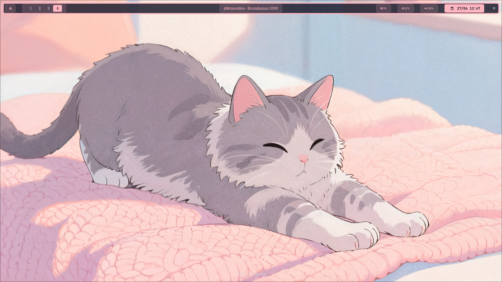
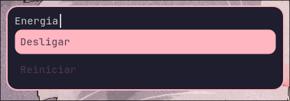
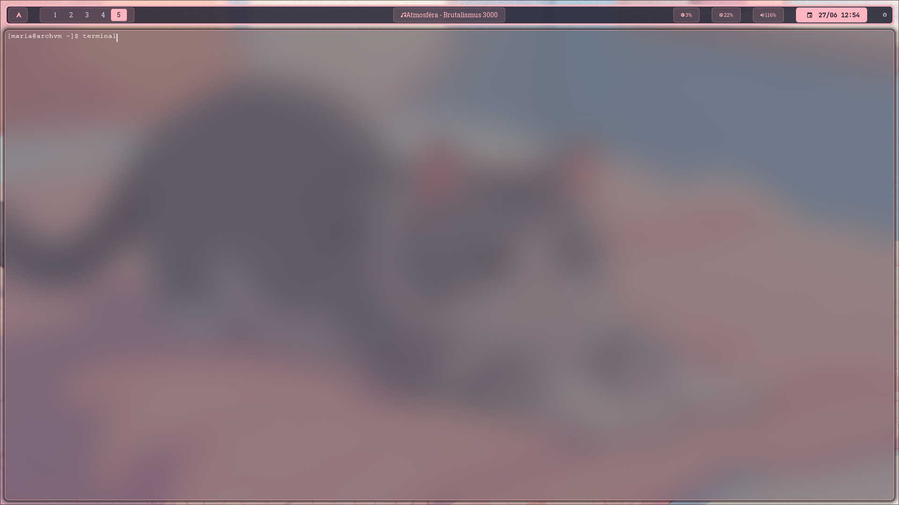

# Maria Luiza - Dotfiles

Bem-vindo ao meu repositório de configurações pessoais. Este é o meu ambiente de estudos e evolução contínua no Linux, customizado de acordo com as minhas necessidades de acessibilidade, conforto visual e produtividade.

---

## Preview do meu setup

**Desktop:**
<p align="center">
  
</p>

**Power Menu:**
<p align="center">
  
</p>

**Terminal (Kitty):**
<p align="center">
  
</p>

<p align="center">
  Hyprland + Arch Linux + Um ambiente feito para focar
</p>

---

## Tecnologias e Ferramentas

* OS: Arch Linux
* WM: Hyprland (Wayland)
* Barra: Waybar
* Terminal: Kitty
* Launcher: Rofi
* Wallpaper: Waypaper

---

## Estrutura do Repositorio

Aqui estão organizados os meus arquivos de configuração:
```text
dotfiles/
├── hypr/          # Configuracoes do gerenciador de janelas
├── waybar/        # Barra de status do sistema
├── kitty/         # Customizacao do terminal
├── rofi/          # Menu de aplicativos e atalhos
├── waypaper/      # Gerenciador de papeis de parede
└── scripts/       # Automacoes (captura de tela, volume, etc.)
